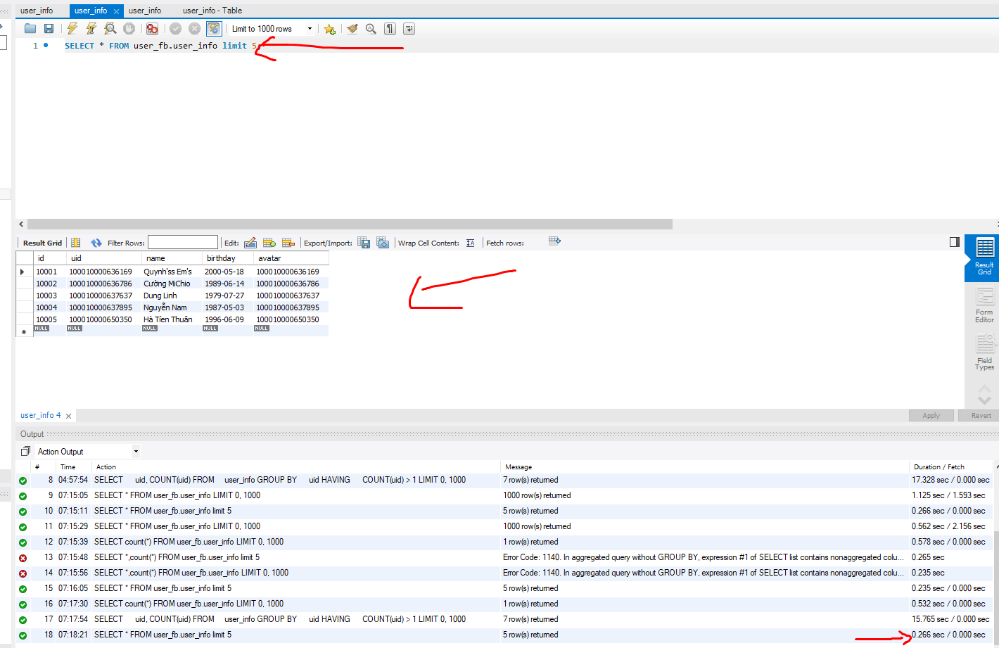

# remove-duplicate-row-in-mysql
remove duplicate row in mysql

## Now I have a table that have 5m rows


## Here is 5 first sample datas


## Now I want to see what uid is duplicate


```sql
SELECT 
    uid, COUNT(uid)
FROM
    user_info
GROUP BY 
    uid
HAVING 
    COUNT(uid) > 1;
```

It taks 15s to show duplicated UID

## Run file index.py to remove duplicated UID
```
python index.py
```